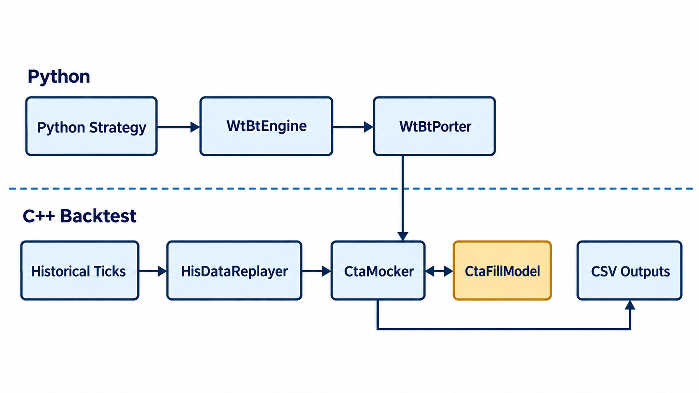

# wtpy：CTA 回测接口改动

这个仓库基于 [wtpy 原版](https://github.com/wondertrader/wtpy)，不是 wtpy 官方仓库。wtpy 原有的策略接口、数据组件、监控和回测封装都来自原项目；我在这里改的是 CTA 回测成交模型的 Python 入口，以及几份用于核对回测结果的脚本。对应的 C++ 改动在 [wondertrader-cta-fill-lab](https://github.com/newbigdeng/wondertrader-cta-fill-lab)。

## 原版 wtpy 怎么接 WT

CTA 策略通过 `CtaContext` 使用接口，`WtBtEngine` 负责回测配置与启动，`WtBtWrapper` 调用底层 `WtBtPorter` 动态库。历史数据回放、模拟成交和记账仍在 C++ 侧。仓库里的 `apps/` 放分析、优化等工具，`monitor/` 是原版监控模块；它们不是这次改动的范围。

图只画 CTA 回测的主要调用和数据路径。`CtaFillModel` 属于配套 WT 仓库的 C++ 代码，不是 wtpy 的 Python 类。

## 我改了什么

C++ 侧有了不同成交规则后，我希望从 Python 侧切换模型、重复跑实验，不必每次改 C++ 配置。因此这里主要动了两个入口：

- `WtBtEngine.set_cta_strategy()` 可以选择 `legacy_cta`、`causal_touch` 或 `volume_limited`，并传入事件等待和成交量参与率参数。默认仍使用原来的 Legacy 路径。
- `WtBtWrapper` 对接新旧 C++ 入口，检查参数；开发时可用 `WTPY_BT_PORTER_LIB` 指向自己编译的 `WtBtPorter.so`，不需要覆盖 wtpy 自带文件。
- [`personal/`](personal/) 里放了 Tick 成交量检查、反手与目标覆盖核对，以及成交假设敏感性实验的脚本。脚本和 C++ 库需要配套使用；仅安装官方 wtpy 不能运行新增模型。

改动入口是 [`WtBtEngine.py`](wtpy/WtBtEngine.py) 和 [`WtBtWrapper.py`](wtpy/wrapper/WtBtWrapper.py)。这些工作针对 CTA 回测，不代表实盘成交链路也已接入。

原版项目：[wtpy](https://github.com/wondertrader/wtpy) · [WonderTrader](https://github.com/wondertrader/wondertrader)。本仓库保留原项目的 [MIT 许可](LICENSE) 与 Git 历史。
